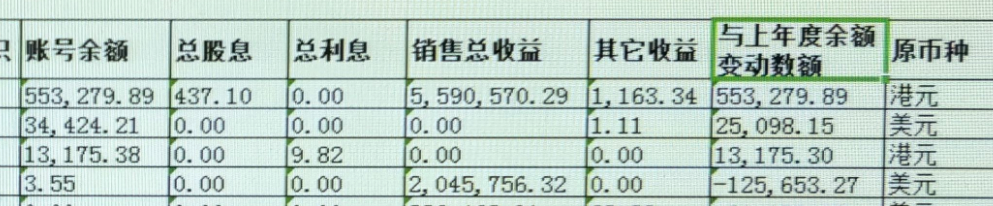
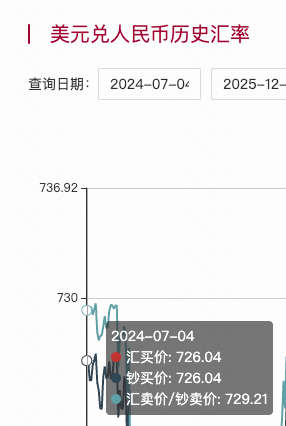

# 境外所得税

2022 年和 2023 年的境外所得列表，已要求海淀区税务局第三税务所（电话010-82481658）发邮件给我。文件较大无法放在此处，详见邮箱，或者微信-收藏。

## 已知信息

### 券商+税务局

已电话咨询过富途、长桥，他们都是 CRS 来上报数据，除了账户的基本信息（账号名、姓名、出生日期、住址等）外，会上报的数据有：

- 年度账号余额
- 总股息，比如分红
- 总利息
- 销售总收益（买入/卖出股票的交易总额）
- 其他收益（按券商的说法，包含优惠券，卡券，活动礼包等）
- 与上年度余额变动数额

不会上报的数据：

- 出入金
- 盈亏数据
- 交易流水

税务局给我的境外收入列表如下（核心信息）：

## 结论

根据多次与税务局、券商的沟通，已经确定税务局不清楚我股票的盈亏，需要我自行去券商 APP 确认盈利情况，再去缴税。

鉴于我最近几年炒股每年都亏，因此我决定按照最小必缴数额来进行交税。

在税务局提供的这些数据里，总股息、总利息肯定是正的，这些是必须要缴税的。税务局也不清楚【其他收益】到底指的是什么，因此最小必缴税额就是：总股息 + 总利息。

## 境外交税情况

| 年度 | 总股息               | 总利息 | 其他收益                                     | 缴税基数 | 缴税税款                            | 缴税时间   |
| ---- | -------------------- | ------ | -------------------------------------------- | -------- | ----------------------------------- | ---------- |
| 2022 | - 437.1  - 151.59 | 9.82   | - 1163.34  - 1.11  - 68.88  - 44.66 | 598.51   | 应补税额：119.7 元 滞纳金：53.39 元 | 2025-12-08 |
| 2023 | 无                   | 83.12  | - 1515.2  - 2.69                          | 83.12    | 应补税额：16.62 滞纳金：4.37        | 2025-12-08 |
| 2024 | 1510（阿里巴巴分红） |        |                                              |          | 应补税额：302 滞纳金：24.31         | 2025-12-08 |
| 2025 | 1400 刀（富途分红）  |        |                                              |          | 税额：2012.78元（按汇率 7.1885 算） | 2026-05-14 |

### 2024 年

在 2025-12-08，税务局还没有 2024 年的数据，但是查看券商数据，能确定分红数据，尽量提前缴纳税款，少交滞纳金。

长桥，2024-07-04，阿里巴巴美股分红，207.5 刀，按 2024-07-04 的汇率中间价，207.5\*7.276=1509.77

207.5\*7.276=1509.77

### 2025 年

## 滞纳金

居民个人从中国境外取得所得的，应当在取得所得的次年3月1日至6月30日内申报纳税。例如，个人在2024年取得境外所得，应在2025年3月1日 - 6月30日申报纳税并缴纳税款，若未按时缴纳，滞纳金从6月30日的次日开始计算。
